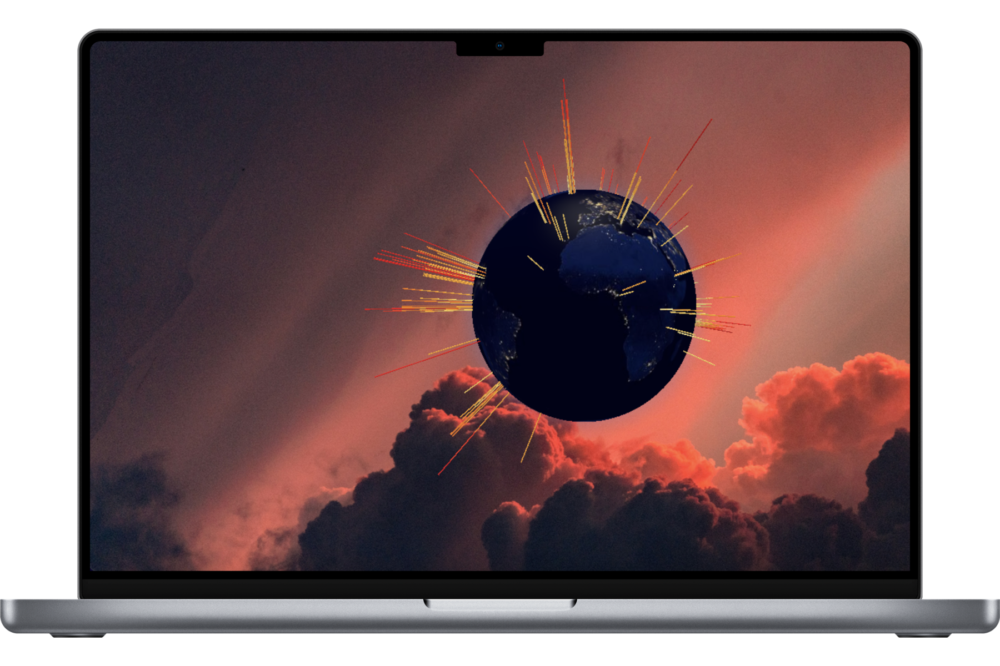
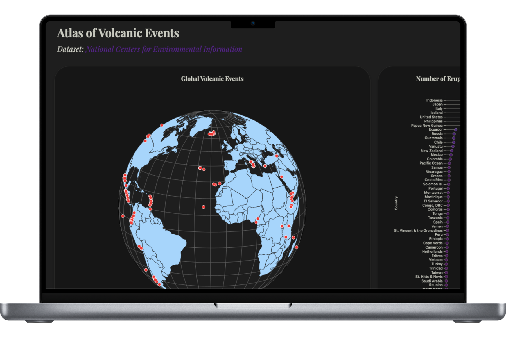

# Visualizing Volcanic Eruption Events

## Demo

[**Live Demo Graphic**](https://jacquelinehf-xray-classifier.hf.space/](https://jacqueline.dev/volcanoatlas/)

[**Live Demo Dashboard**](https://jacquelinehf-xray-classifier.hf.space/](https://jacqueline.dev/dashboard/)

## Overview
This repo contains code to visualize a dataset of volcanic eruption events from the National Centers for Environmental Information, including:
- A 3D globe created with Three.js that maps Volcanic Explosivity Index (VEI) to colors and point sizes, enables user interaction with TrackballControls for rotation and zoom, and continuously rotates the globe for a dynamic visualization.
- D3.js to create a bar chart, scatter plot, and globe visualization that display information about volcanic events in the tooltip.
